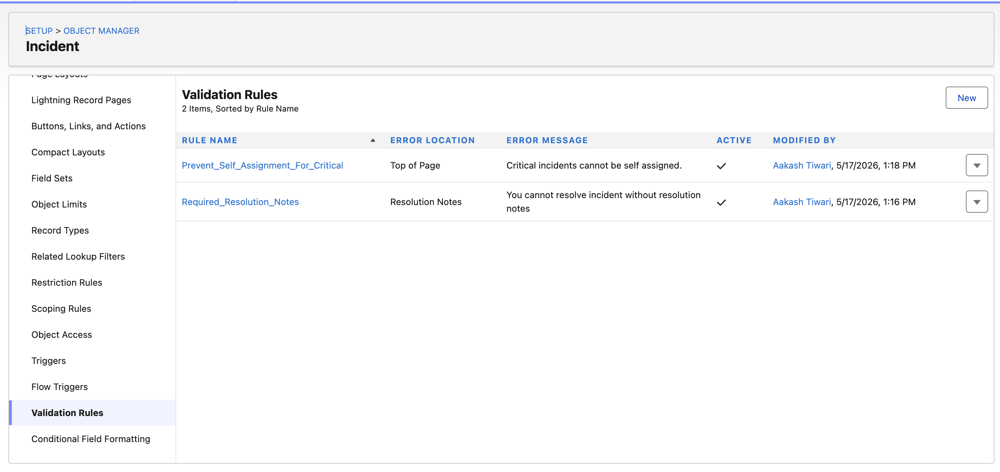

# ITSM Enterprise Salesforce Project — Current Progress

## Project Initialization

### Repository & Branch Setup

```bash
git checkout -b feature/incident-object

git checkout -b feature/security-model

git checkout -b feature/lwc-dashboard
```

### Org Authorized

- Salesforce Org authenticated successfully
- Development environment connected

---

# IMPLEMENTED DATA MODEL

## OBJECT 1 — Vendor__c

### Purpose

External vendor management:

- Dell
- Lenovo
- HP
- AWS Support
- External Infra Teams

### Fields

| Field | Type |
|---|---|
| Name | Text |
| Vendor_Code__c | Text |
| Support_Email__c | Email |
| Support_Number__c | Phone |
| SLA_Level__c | Picklist |
| Active__c | Checkbox |

---

## OBJECT 2 — Asset__c

### Purpose

Tracks enterprise assets:

- Laptops
- Devices
- Servers
- Applications
- Infrastructure Assets

### Fields

| Field | Type |
|---|---|
| Asset_Tag__c | Auto Number |
| Asset_Name__c | Text |
| Asset_Type__c | Picklist |
| Serial_Number__c | Text |
| Warranty_Expiry__c | Date |
| Vendor__c | Lookup(Vendor__c) |
| Assigned_To__c | Lookup(User) |
| Status__c | Picklist |

---

## OBJECT 3 — Major_Incident__c

### Purpose

Enterprise-level incident grouping.

### Example

VPN outage affecting 200 employees

### Fields

| Field | Type |
|---|---|
| Major_Incident_Number__c | Auto Number |
| Title__c | Text |
| Description__c | Long Text |
| Status__c | Picklist |
| Priority__c | Picklist |
| Root_Cause__c | Long Text |
| Resolution__c | Long Text |
| Started_At__c | DateTime |
| Resolved_At__c | DateTime |
| Incident_Count__c | Number |
| Incident_Commander__c | Lookup(User) |

---

## OBJECT 4 — Incident__c

### Purpose

Core ITSM workflow entity.

### Fields

| Field | Type |
|---|---|
| Incident_Number__c | Auto Number |
| Subject__c | Text |
| Description__c | Long Text |
| Status__c | Picklist |
| Priority__c | Picklist |
| Category__c | Picklist |
| Sub_Category__c | Picklist |
| SLA_Due_Date__c | DateTime |
| SLA_Breached__c | Checkbox |
| Resolution_Notes__c | Long Text |
| Root_Cause__c | Long Text |
| Resolved_Date__c | DateTime |
| Vendor__c | Lookup(Vendor__c) |
| Asset__c | Lookup(Asset__c) |
| Major_Incident__c | Lookup(Major_Incident__c) |
| Assigned_To__c | Lookup(User) |

---

# Important Design Decision

## Ownership Model

Initially:

```text
Owner = Queue
```

NOT engineer assignment directly.

### Why?

Enterprise ITSM systems operate using queue-driven intake and triage models.

### Benefits

- Centralized triage
- Better SLA management
- Controlled assignment lifecycle
- Easier escalation workflows

---

## OBJECT 5 — Incident_Team_Member__c

### Purpose

Provides:

Incident ↔ User Collaboration

with:

- Role-based access
- Sharing
- Visibility
- Collaboration lifecycle

### Inspired By

- Opportunity Teams
- Account Teams
- Case Teams

### Fields

| Field | Type |
|---|---|
| Incident__c | Master Detail |
| User__c | Lookup(User) |
| Team_Role__c | Picklist |
| Access_Level__c | Picklist |
| Active__c | Checkbox |
| Joined_At__c | DateTime |
| Left_At__c | DateTime |

### Team Roles

- Incident Commander
- Senior Engineer
- QA Reviewer
- Vendor Coordinator
- Security Reviewer
- IT Manager

---

# Incident Team Sharing Architecture

## OWD Configuration

```text
Incident__c = Private
```

## Sharing Flow

```text
Incident Team Member Created
        ↓
Trigger Fires
        ↓
Sharing Service Executes
        ↓
Incident__Share Inserted
        ↓
Collaborator Gains Access
```

## Apex Sharing Reason

Custom sharing reason created:

```text
Incident_Team_Access__c
```

### Importance

Enables:

- Safe access removal
- Collaboration isolation
- Controlled sharing lifecycle
- Enterprise-grade record access management

---

## OBJECT 6 — Asset_Request__c

### Purpose

Approval-driven procurement/request flow.

### Fields

| Field | Type |
|---|---|
| Request_Number__c | Auto Number |
| Asset__c | Lookup |
| Requested_By__c | Lookup(User) |
| Cost__c | Currency |
| Justification__c | Long Text |
| Approval_Status__c | Picklist |
| Security_Review_Required__c | Checkbox |

---

## OBJECT 7 — SLA_Log__c

### Purpose

Tracks:

- SLA timings
- Breach history
- Audit trail

### Fields

| Field | Type |
|---|---|
| Incident__c | Lookup |
| SLA_Start__c | DateTime |
| SLA_End__c | DateTime |
| Breached__c | Checkbox |
| Resolution_Time_Minutes__c | Number |

---

## OBJECT 8 — Escalation_Log__c

### Purpose

Tracks escalation history.

### Fields

| Field | Type |
|---|---|
| Incident__c | Lookup |
| Escalated_From__c | Lookup(User) |
| Escalated_To__c | Lookup(User) |
| Escalation_Level__c | Number |
| Escalated_At__c | DateTime |

---

## OBJECT 9 — Error_Log__c

### Purpose

Enterprise-grade observability and diagnostics.

Used by:

- Apex
- Flows
- Integrations
- Queueables

### Fields

| Field | Type |
|---|---|
| Error_Message__c | Long Text |
| Stack_Trace__c | Long Text |
| Apex_Class__c | Text |
| Flow_Name__c | Text |
| Severity__c | Picklist |
| Occurred_At__c | DateTime |

---

# Enterprise Architecture Decisions Completed

## Security Model

- Private sharing model
- Apex-managed sharing
- Team-based collaboration access

## Incident Architecture

- Queue-first ownership
- Major incident grouping
- SLA tracking
- Escalation management

## Observability

- Centralized error logging
- Audit-driven SLA logs
- Escalation traceability

## Scalability Foundations

- Modular object design
- Enterprise-grade sharing model
- Future-ready automation architecture

---

# Current Status Summary

| Module | Status |
|---|---|
| Project Setup | Completed |
| Branch Strategy | Completed |
| Org Authorization | Completed |
| Core Data Model | Completed |
| Security Architecture | Completed |
| Sharing Design | Completed |
| Incident Team Model | Completed |
| SLA Architecture | Completed |
| Escalation Tracking | Completed |
| Error Observability | Completed |

---

# Custom Metadata Types (CMDT)

| Metadata | Purpose |
|---|---|
| SLA_Config__mdt | SLA timings |
| Escalation_Config__mdt | Escalation rules |
| Pattern_Detection_Config__mdt | AI thresholds |
| Incident_Team_Config__mdt | Auto team assembly |

---

# Additional Changes

Added the following fields in `Incident__c`:

- Status
- Assigned_To__c

---

# Validation Rules

## 1. Resolution_Notes_Required

### Navigation

```text
Object Manager
→ Incident__c
→ Validation Rules
→ New
```

### Rule

```sql
AND(
    OR(
        ISPICKVAL(Status__c, "Resolved"),
        ISPICKVAL(Status__c, "Closed")
    ),
    ISBLANK(Resolution_Notes__c)
)
```

### Notes

We have an option for:

- Showing error on field
- Showing overall page-level error

If validation rule returns:

```text
TRUE
```

then validation fails.

---

## 2. Prevent_Self_Assignment_For_Critical

### Navigation

```text
Object Manager
→ Incident__c
→ Validation Rules
→ New
```

### Rule

```sql
AND(
    ISPICKVAL(Priority__c, "Critical"),
    Assigned_To__c = CreatedById
)
```

---

## 3. Root_Cause_Required

### Navigation

```text
Object Manager
→ Major_Incident__c
→ Validation Rules
→ New
```

### Rule

```sql
AND(
    ISPICKVAL(Status__c, "Closed"),
    ISBLANK(Root_Cause__c)
)
```

---

## 4. Justification_Required

### Navigation

```text
Object Manager
→ Asset_Request__c
→ Validation Rules
→ New
```

### Rule

```sql
ISBLANK(Justification__c)
```

---

# Important Interview Point

Validation Rules run:

- BEFORE save
- BEFORE Apex Triggers

Very important Salesforce concept.